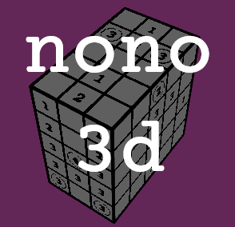
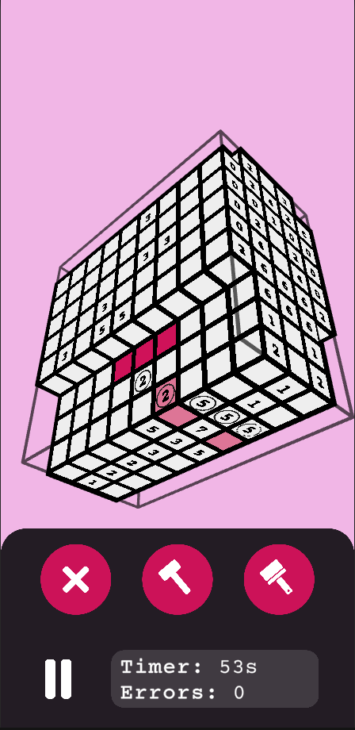

# Nono 3D

This is a Picross 3D clone made in Unity3D for Android. It contains a level editor and a puzzle solver.

The main issue is the puzzle generation (hint removal) algorithm, which fails to generate interesting puzzles. If you have any information on how to generate good 3d nonogram puzzles, please contact me.

Also on [itch.io](https://tesseractcat.itch.io/nono-3d).

## Future Steps

- Clean up codebase
- Use a SAT solver to solve puzzles
- Explore different puzzle generation methods
- Themed puzzle packs
- Fix slow list population
- Fix camera panning/rotation velocity
- Add community puzzle sharing

## Credits

TODO

## Screenshots

